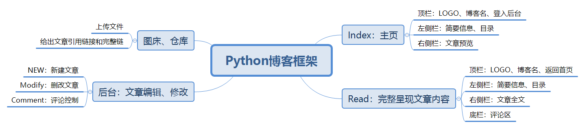

## 说明：

- 介绍

  动态博客系统，前端+后端。
  
- 功能

|     预定功能     | 实现情况 |
| :--------------: | :------: |
|    登陆到后台    |   100%   |
|  后台写markdown  |   100%   |
| 后台上传markdown |   90%    |
|   后台删除文章   |   100%   |
|   后台修改文章   |   100%   |
| host图床、下载站 |   100%   |
|     评论系统     |    0%    |
|     网页美化     |   60%    |

- 逻辑

  - 首页：index，文章展示，登陆后台接口，站内搜索接口
  - 文章详情页：内容、打赏、评论、相关文章
  - 后台：markdown文章编辑、markdown文件上传，发表时间；文章删除、文章修改




- 安装依赖

  ```shell
  pip3 install flask, gevent, markdown
  ```

- 剩余bug（或有待改进点）
- 编辑页面的富文本框，暂时不能所见即所得的markdown
  - 插入``代码写入图片后文章图片缩放不能适应，暂时要手动改成``
  - 新建文章加入直接插入图片、文件、视频的选项（取代手动上传和写代码）
  - index页面的文章没有简述

- 参考资料

  1、【CSDN】网页分块设计：https://blog.csdn.net/yueliang0423/article/details/50890055
  
  2、【简书】Flask操作session：https://www.jianshu.com/p/dd0aa75f3f0e
  
  3、【博客园】[[原创\]用python写了一个简单的markdown编辑器](https://www.cnblogs.com/Mr_wolong/p/4097508.html)
  
  4、【博客园】python-markdown：https://www.cnblogs.com/JiangLe/p/12682912.html
  
  5、Python-Markdown Documentation：https://python-markdown.github.io/extensions/api/
  
  6、【CSDN】利用python 在网页上显示markdown：https://blog.csdn.net/wangchao8110/article/details/85221568
  
  7、【MySQL技术派】python-markdown：https://sqlpy.com/blogs/182142864#markdownextensionstables